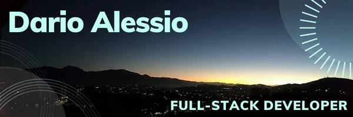

### Hi there 👋

- I’m a **Full-Stack Developer** graduated from Microverse academy.
- I'm looking for an opportunity to work developing software, onsite or remote.
- I have experience with: `Ruby on Rails` `API Documentation` `Ruby` `JavaScript` `React` `Redux` `HTML/CSS` `Rspec` `Gitflow` `PostgreSQL` `Kanban`.
- I have coded more than **1500 hrs** on projects with international partners from around the world.
- I have years of experience as a **Product Manager** in the financial industry (I've been "the client" so many times). 
- I speak English, Spanish and Italian, and read French.
- I'm also a Mechanical Engineer and MBA.
- I **enjoy interaction / communication** with partners, clients or directors as well.
- I like a lot working in teams and making new friends out of my team's partners.
- 📫 How to reach me: 

GitHub: [Dario Alessio](https://github.com/DarioAlessioR)

Slack: [Dario Alessio](https://microverse-students.slack.com/team/U039GCFRK9B)

LinkedIn: [Dario Alessio](https://www.linkedin.com/in/dario-alessio-3a3b7911b)

- Pronouns: He / Him
- ⚡ Fun fact: Yes, I took the above picture. It's the dawn viewed from my home at Caracas.

