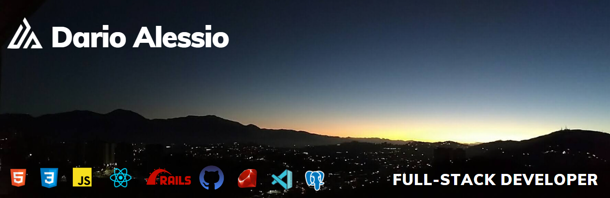

### Hi there 👋

- I’m a Full-Stack Developer who graduated from Microverse Academy.
- I work remotely as `Ruby on Rails` developer for an international startup.
- I have experience with: `Ruby on Rails` `API Documentation` `Ruby` `JavaScript` `React` `Redux` `HTML/CSS` `Rspec` `Gitflow` `PostgreSQL` `Kanban` `Trello`.
- I have coded more than `2300 hrs` on projects with international partners from around the world.
- I have years of experience as a Product Owner` / `Product Manager` in the financial industry (I've been "the client" so many times). 
- I speak `English`, `Spanish` and `Italian`, and read `French`.
- I'm also a `Mechanical Engineer` and `MBA`.
- I enjoy `interaction` / `communication` with partners, clients, or directors as well.
- I like working in teams and making new friends.
- 📫 How to reach me: 

LinkedIn: [Dario Alessio](https://www.linkedin.com/in/dario-alessio-3a3b7911b/?locale=en_US)

GitHub: [Dario Alessio](https://github.com/DarioAlessioR)

Slack: [Dario Alessio](https://microverse-students.slack.com/team/U039GCFRK9B)

- Pronouns: He / Him

- Some stats:

- ⚡ Fun fact: Yes, I took the above picture. It's the dawn viewed from my home at Caracas.
